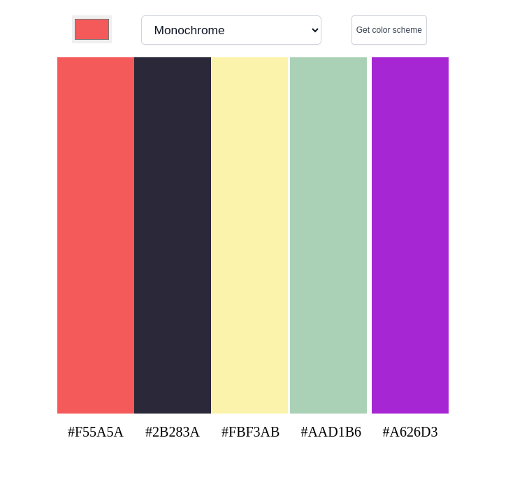
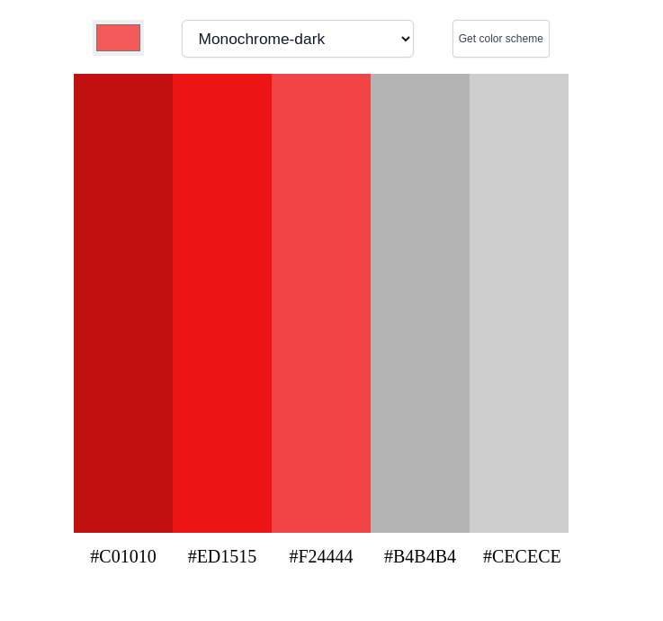
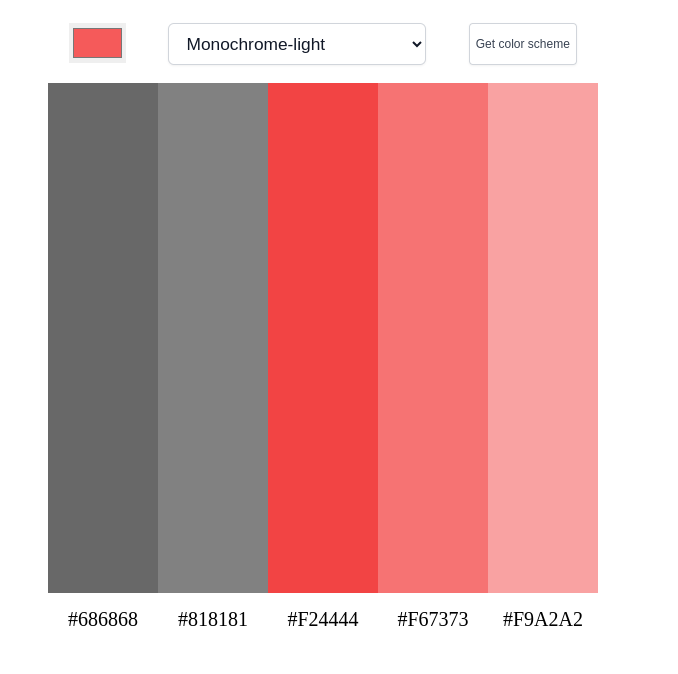
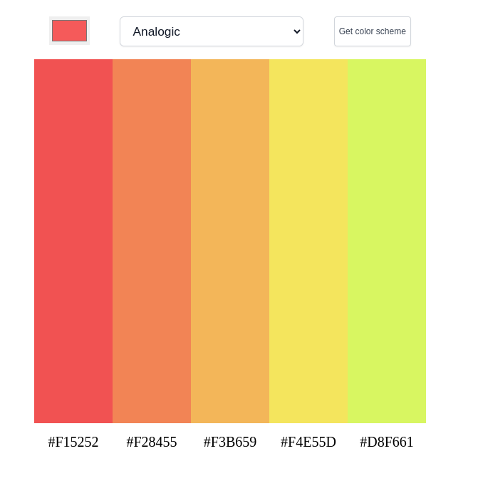
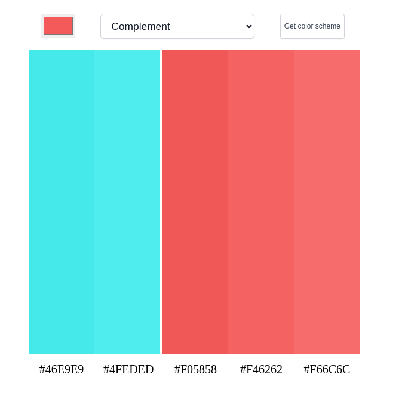
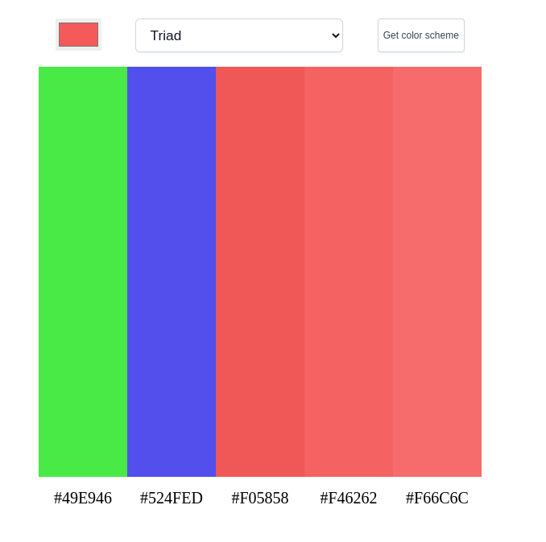

# Color Scheme Generator 🎇🌅

Hello there,

This is the best project which is about  color scheme. In this site you can get different types of color and change them.

Live: [Color-Scheme-Generator](https://color-scheme-generator-site.netlify.app/)


------


## Different Colors

+ Monochrome
+ Monochrome-dark
+ Monochrome-light
+ Analogic
+ Complement
+ Analogic-complement
+ Triad

### Monochrome




### Monochrome-dark




### Monochrome-light




### Analogic




### Complement




### Analogic-complement


### Triad




-----

## Languages and Tools are used 🗣️🔧

1. **Languages** 🗣️
    + [HTML](https://github.com/topics/html)
    + [HTML5](https://github.com/topics/html5)
    + [CSS](https://github.com/topics/css)
    + [CSS3](https://github.com/topics/css3)
    + [JavaScript](https://github.com/topics/javascript)

2. **Tools** 🔧
    + [Chrome](https://github.com/topics/chrome)
    + [VSCode](https://github.com/topics/vscode)
    + [Figma](https://github.com/topics/figma)
    + [Netlify](https://github.com/topics/netlify)


-----


## Cloning the project 🪛🔨

```
# Clone this repository
$ git clone https://github.com/MastooraTurkmen/Color-Scheme.git

# Go inside the repository
$ cd Color-Scheme

```

## Deployment📥

1. How to deploy our project to the Netlify site?
2. I use [Netlify App](https://app.netlify.com/) for deploying my projects.
3. Go to the Netlify site and select Add a new site.
4. From there select **_Deploy with Github_**.
5. Then write your project name and select it.
6. After selecting here you can see that the project **_Review configuration for Color-Scheme_** and then select the **_Deploy Color-Scheme_** Button.
7. Now your project is Live.


------

## Author 👩🏻‍💻 

**Mastoora Turkmen**  
<br>
[LinkedIn](https://www.linkedin.com/in/mastoora-turkmen/) 
<br>
[Github](https://github.com/MastooraTurkmen/) 
<br>
[Twitter](https://twitter.com/MastooraJ22)