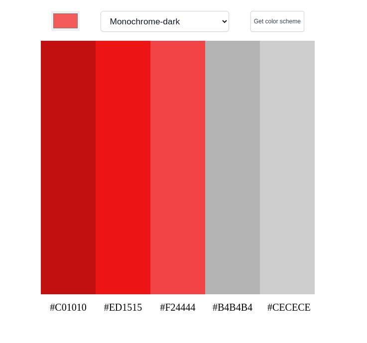
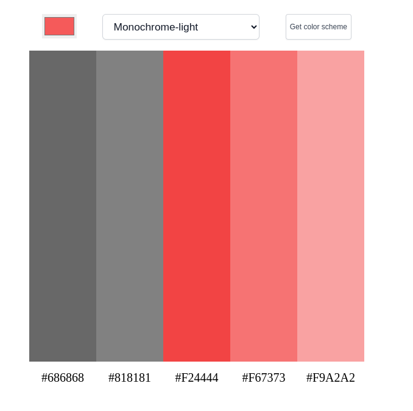
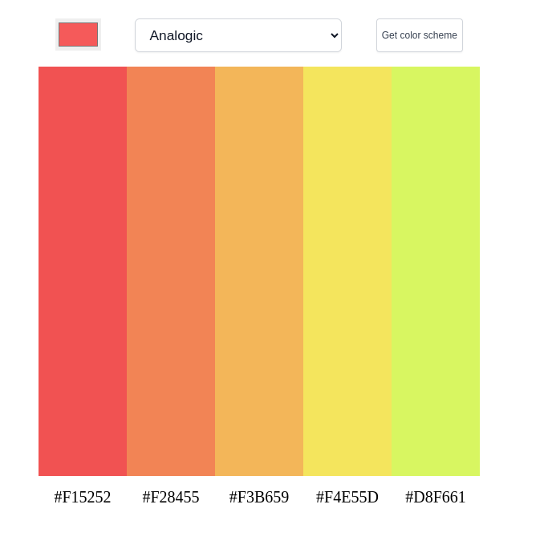
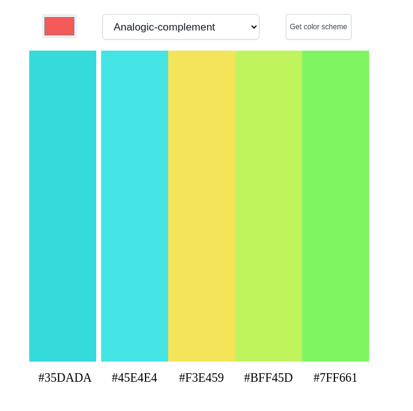
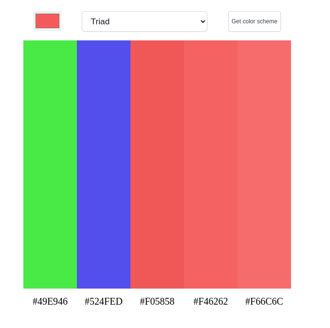

# Color Scheme Generator

Hello there,

This is my another project which is about  color scheme. In this site you can get different types of color and change them. I am so much happy that I am sharing my project with all of you. Thank you so much for your nice attention. 

------

## Different Colors

+ Monochrome
+ Monochrome-dark
+ Monochrome-light
+ Analogic
+ Complement
+ Analogic-complement
+ Triad

### Monochrome

### Monochrome-dark

### Monochrome-light

### Analogic

### Complement

### Analogic-complement

### Triad

## Languages and Tools are used

1. **Languages** 🗣️
    + [HTML](https://github.com/topics/html)
    + [HTML5](https://github.com/topics/html5)
    + [CSS](https://github.com/topics/css)

